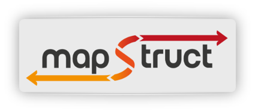

# Projeto Final - Desenvolvimento de Software Através de Frameworks @ IFMT/2023

- **Biblioteca/Framework:** [Mapstruct](https://mapstruct.org/) e [ModelMapper](https://modelmapper.org/)
- **Tecnologias aplicadas:** Java e Spring Boot
- **Integrantes:**
  - Adriano Carvalho
  - Álvaro Claro
  - Clodoaldo Barbosa
  - Jaílson Ribeiro
  - Ricardo Barcelar
  - Zenildo Crisóstomo

## 1. Descrição da biblioteca/framework

MapStruct e ModelMapper são algumas das muitas soluções voltadas para mapeamento de dados, 
quando se esta desenvolvendo softwares utilizando o paradigma de orientação a objetos.

## 2. Descrição do problema

### 2.1 Introdução

Criando soluções usando o paradigma de Orientação a Objetos, em algum momento após um processamento 
surgirá a necessidade de retornar dados.

Esses dados existem na forma de atributos contidos em entidades, que são objetos instanciados de 
classes, modeladas de acordo com o domínio do problema computacional a ser resolvido.

A troca dos dados entre esses objetos, bem como a resposta a um pedido externo, como o acesso a um 
endpoint que faz parte de uma API RESTFull, geralmente, não podem ou não devem ter todos os seus 
atributos visíveis ou expostos.

Vamos então, por um momento pensar num caso hipotético, onde temos Uma entidade **Usuario**, 
possuindo 3 atributos básicos: id, nomeUsuario e senha.

Num eventual cenário, onde temos um cadastro de usuário pela internet, deve ser devolvido os dados 
cadastrados, porém a senha **não deve aparecer** na resposta.

Isso acontece, pois por um motivo ou outro, é utilizado a mesma entidade para persistir e devolver
os dados cadastrados, como mostrado na imagem abaixo:

### 2.2 DTOs

O Design Pattern DTO, Data Transfer Object (Objeto de Transferência de Dados), é uma solução que auxilia
na tarefa de levar os dados recuperados ou persistidos de um banco de dados através das camadas lógicas,
resolvendo o problema citado acima.

Na prática a solução consiste em mapear (copiar) os dados do objeto completo para um outro objeto contendo
somente os atributos que devem ser devolvidos ou expostos durante um processamento.

Para ajudar a identificar essas classes mapeadoras, convencionou-se que as mesmas tenham o termo DTO em 
seu nome, seja como prefixo ou sufixo.

Abaixo, as 2 classes: **Usuario** e **UsuarioDto**

### 2.3 Entidades Grandes

A transferência dos dados de um objeto para outro é feita por meio de **getters** e **setters**, ou ainda,
via constructor durante o processo de instanciação.

Vejamos um outro cenário hipotético, onde temos uma entidade Pessoa contendo desta vez 7 atributos: 
Id, Nome, CPF, RG, Sobrenome, DataNascimento, Sexo.

Ao acessar um endpoint que traz a lista das pessoas cadastradas, precisamos que venha somente 4 atributos: 
Id, Nome, CPF, DataNascimento.

Abaixo a entidade e o DTO:

Abaixo o código do controlador que retorna a lista das pessoas cadastradas utilizando getters e setters:

Abaixo o código do controlador que retorna a lista das pessoas cadastradas utilizando construtor:

É perceptivel que a quantidade de código aumenta de acordo com a quantidade de atributos que precisa
ser enviada/recebida, sejam internas entre objetos, seja externa atendendo a pedidos de aplicações.

Desta forma em aplicações simples onde temos poucos atributos é tranquilo fazer mapeamento de dados com
DTOs, seja com getters e setters, seja com construtores.

Mas em algumas aplicações, onde existem 2 ou mais entidades, e cada uma contendo mais de 20 atributos, 
é necessário se pensar em alguma outra solução.

## 3. Solução

Para resolver o problema de fazer o mapeamento de dados em entidades com muitos atributos, surgem os
***Frameworks de Mapeamento***.

Na atualidade existem vários, iremos abordar abaixo somente 2 deles.

### 3.1 MapStruct

Escrever código de mapeamento e tedioso e propenso a erros, MapStruct simplifica este trabalho por
automatizar esse trabalho geradondo código que simplifica bastante as implementações de mapeamento 
de dados entre as classes Java.

O código gerado para fazer o mapeamento usa métodos de invocação simples e desta forma é rápido, 
com tipo seguro e fácil de entender.

Além disso ele é um processador de anotações que é plugado no compilador Java e pode ser usado 
nos builds de linha de comando (Maven, Gradle, etc) bem como de dentro da sua IDE preferida.

Em contraste com outros frameworks de mapeamento, MapStruct gera classes de mapeamento em tempo 
de compilação que assegura uma alta performance, permitindo ao desenvolvedor um rápido feedback 
e checagem de erros, inclusive via debug.

#### 3.1.1 Instalação

Para fazer a instalação do Mapstruct em nosso projeto, precisamos simplesmente acrescentar no 
arquivo de configuração das dependências, seja ele Maven ou Gradle, as informações de configuração
do MapStruct:

No arquivo POM.XML usando Maven:

No arquivo Build.Gradle usando Gradle:

#### 3.1.2 Implementação

Já para a implementação precisamos criar uma interface e configura-la com anotações do MapStruct. No nosso
projeto exemplo chamamos a interface do MapStruct de ***PessoaMapperMS***.

Na classe que precisa realizar o mapeamento, no nosso caso o ***PessoasController***, basta injetar o 
MapStruct e chamar os métodos que indicam o sentido do mapeamento: toDto (entidade -> dto), toEntity 
(dto -> entidade). O mapeamento é realizado de forma automática, desde que os atributos tenham os 
mesmos nomes, tanto na entidade origem como no dto destino e vice versa.

Após a compilação, se abrir a pasta target pode ser encontrado lá o código gerado pelo MapStruct, como 
podemos ver abaixo na imagem:

Se os atributos mapeados possuem nomes diferentes basta na interface do mapeador, no nosso caso PessoaMapperMS,
usar a anotação ***@Mapping*** para indicar quem são os atributos origem/destino (source/target):

O MapStruct também auxilia em processos de conversão, caso algum atributo precise, como é o caso das datas 
que no banco de dados, por exemplo, são armazenadas em yyyy-mm-dd e precisam ser convertidas para mostrar 
dd/mm/yyyy:

Permite ainda dar nome a um método e chamá-lo para fazer uma formatação customizada antes de fazer o mapeamento, 
que no caso abaixo é a inclusão da máscara do CPF:

### 3.2 ModelMapper

Projetado para auxiliar de forma fácil e automática no mapeamento de objetos, determinando de forma
inteligente como um objeto mapeia para o outro objeto.

ModelMapper é baseado em convenções, do mesmo jeito que um ser humano faria, analisando o objeto model 
e determinando de forma inteligente como os dados devem ser mapeados.

#### 3.2.1 Instalação 

Para fazer a instalação do ModelMapper no projeto, simplesmente acrescente no arquivo de configuração de
dependências, seja Maven ou Gradle, as informações de configuração:

No arquivo POM.XML usando Maven:

No arquivo Build.Gradle usando Gradle:

#### 3.2.2 Implementação

Para ser o mais automático possível, o ModelMapper possui 3 tipos de estratégias de atribuição/combinação:
Standard, Loose e Strict.

Para iniciar a implementação utilizando o ModelMapper basta instanciar um objeto ModelMapper, e se os 
atributos possuem o mesmo nome, basta chamar o método map do objeto passando as classes para serem
mapeadas:

Caso precise iterar dentro de uma lista de objetos:

As operação que não são automáticas, como mudanças de formatação, precisam ser mapeadas, ou seja,
é necessário ensinar o mapeador a fazer o trabalho.

Para ensinar o mapeador existem conceitos que precisam ser usados como:
- Converter: conversores (métodos) que irão auxiliar no mapeamento
- TypeMap: tipos de dados usados nos mapeamentos
- PropertyMap: propriedade/atributo a ser usado nos mapeamentos

No exemplo abaixo, precisamos ensinar o ModelMapper que existe um atributo data que precisa ser convertido
para um atributo string, e inclusive melhorando a sua formatação.

Para isso iniciamos criando um conversor (Converter), indicando o atributo origem (LocalDate) e o atributo 
destino (String), bem como o método via Override contendo o que deve ser feito quando for mapear atributos
de localdate para string:

E por último, configuramos o ModelMapper indicando pra ele quem é será o conversor (toStringDate), bem como
os tipos de dados (LocalDate.class, String.class) quando encontrados que devem usar o conversor 
(.setConverter apontando para toStringDate) quando encontrados: 

Abaixo o código completo, bem como o resultado retornado:

### 3.3 Comparações

***Ranqueamento da Qualidade do Código*** são calculados e fornecidos por Lumnify, sendo que vária de 
L1 a L5, sendo o L5 o mais alto: https://lumnify.com/grades/?rel=libhunt-cmp

Foi usado nesse teste de performance o JMH (Java Microbenchmark Harness), para maiores informações e 
acesso ao código fonte dos testes: 

https://www.baeldung.com/java-microbenchmark-harness 

https://github.com/eugenp/tutorials/tree/master/performance-tests

### 3.4 Considerações Finais

Existem outras soluções: ORIKA, AUTOMAPPER, DOZER, SELMA, JMAPPER.

ModelMapper possui vulnerabilidades, e exige instalação do Dozer como dependência.

Dozer está inativo, e recomenda-se no site do Dozer usar o ModelMapper.

MapStruct é simples e performático.

ModelMapper é muito poderoso (canivete suíço para resolver problemas), porém a performance 
é baixa, sem falar na curva de aprendizagem/uso eficaz que é muito acentuada.

***A solução completa demonstrada aqui, tanto com getters/setters, construtor, MapStruct e ModelMapper,
se encontra disponível na pasta do projeto, aqui do GitHub***

***Para recriar a base de dados para ser usada pela api demonstrada aqui, veja a estrutura no arquivo
application.properties***

## 4. Referências

https://mapstruct.org/

https://modelmapper.org/

https://www.baeldung.com/java-microbenchmark-harness

https://lumnify.com/grades/?rel=libhunt-cmp
