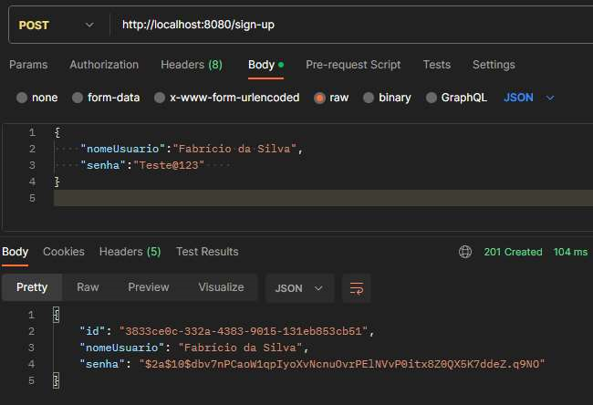
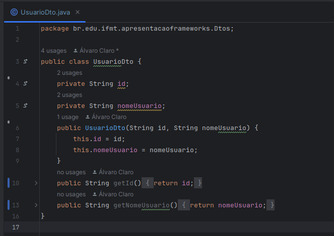
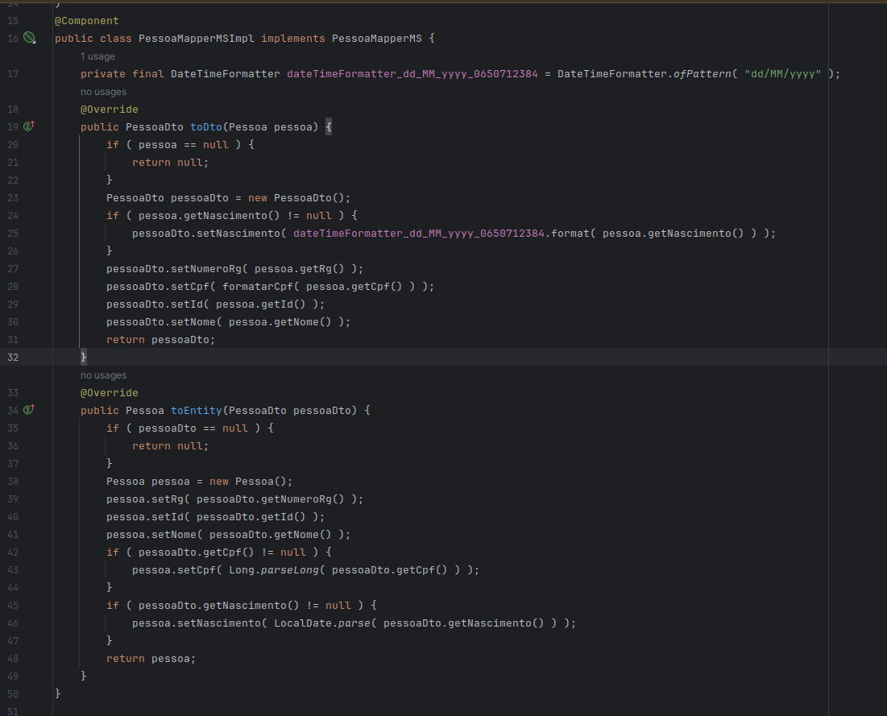

# Projeto final

Em grupos de **até seis pessoas**, escolham uma biblioteca ou framework para elaboração do projeto.

## 1. Requisitos
- Seu projeto deverá ser entregue no formato de link de repositório público do GitHub, a ser enviado para o email `ah.driano@gmail.com` com o título `Projeto Final - IFMT 2023` até o dia 11/11/2023. Este repositório deve conter o código da solução e um arquivo `README.md` conforme o exemplo em anexo.
- O trabalho também deverá ser apresentado no formato de seminário no dia 11/11/2023. Esta apresentação deverá ter entre 15 e 30 minutos.
- A biblioteca ou framework utilizados poderão ser relacionados à qualquer tecnologia, à escolha do grupo.

Referências úteis para escrita de documentos Markdown:
- [Markdown Guide](https://www.markdownguide.org/basic-syntax/)
- [GitHub Docs - Basic writing and formatting syntax](https://docs.github.com/en/get-started/writing-on-github/getting-started-with-writing-and-formatting-on-github/basic-writing-and-formatting-syntax)
- [Mermaid](https://mermaid.js.org/intro/)

---

# Projeto Final - Desenvolvimento de Software Através de Frameworks @ IFMT/2023

- **Biblioteca/Framework:** [Mapstruct](https://mapstruct.org/), [ModelMapper](https://modelmapper.org/) e [Spring boot](https://spring.io/)
- **Tecnologias aplicadas:** Lista de linguagens utilizadas.
- **Integrantes:**
  - Adriano Carvalho
  - Álvaro Claro
  - Clodoaldo Barbosa
  - Jaílson Ribeiro
  - Ricardo Barcelar
  - Zenildo Crisóstomo

## 1. Descrição da biblioteca/framework

O MapStruct e o ModelMapper são duas bibliotecas em Java que têm finalidades semelhantes, que é simplificar o mapeamento de objetos de um tipo para outro. Ambas são usadas para automatizar o processo de mapeamento de objetos.

## 2. Descrição do problema

Ao consultar uma entidade no banco de dados de uma aplicação e retornar os dados para o usuário, informações sensiveis do registro voltam para o usuário que solicitou aquela informação, informações essas como por exemplo senha, dados pessoais e etc, isso se torna um problema pois precisamos esconder essas informações da resposta que retornamos ao usuário.

## 3. Solução

Para resolver esse problema, precisamos criar objetos DTO "Data Transfer Object"(Objeto de Transfêrencia de dados) utilizano somente as propriedades necessárias para atender a requisição do usuário e remover os dados sensiveis, para realizar isso, é necessário fazer manualmente o mapeamentos das propriedades da entidade para as propriedades do DTO.

Porém em entidades grandes e complexas, o mapeamento manual das propriedades da entidade para o DTO pode acabar se tornando uma tarefa extramente demorada, custosa, complexa e com alta probabilidade de falhas com mapeamentos errados ou propriedades importantes que foram esquecidas de serem adicionadas.

Tanto o MapStruct quanto o ModelMapper tentam resolver o problema comum de como mapear automaticamente os dados de um objeto para outro, economizando tempo, reduzindo erros e, em alguns casos, melhorando o desempenho.

Para instalar o Mapstruct em nosso projeto, precisamos simplesmente seguir o passo a passo da [documentação](https://mapstruct.org/documentation/installation/).

  
Na imagem acima vemos o exemplo da entidade Usuário

  
Na imagem acima vemos como o DTO do usuário que vamos usar para retornar dados para o usuário

Para realizar o mapeamento das propriedades do Usuário para o DTO, primeiramente precisamos criar uma interface.
Nesse exemplo vamos chama-la de UsuarioMapperMS.

1. Com nossa interface criada, precisamos anotar ela com a anotação @Mapper, essa anotação serve para indicar para o Spring que essa será uma interface de mapeamento de entidades e qual será o metodo para injeção de dependecias utilizada pela interface, em nosso exemplo estamos utilizando o padrão "spring" que nos permitirá injetar o mapper em nossas classes através da anotação @Autowired.
  Agora, precisamos criar nossos metodos de mapeamento, no nosso exemplo temos dois metodos, um chamado toDto e outro chamado toEntity

2. O metodo **toDto** é responsavel por mapear um objeto do tipo Pessoa para um objeto PessoaDto. Esse metodo recebe 3 anotações do tipo @Mapping, essas anotações servem para dar instruções ao mapstruct de como ele deve mapear as propriedades de um objeto para o outro.  
   1. Na linha 12 estamos dizendo para ele que ao converter a propriedade "nascimento", ja converta a mesma para uma string no formato indicado.  
   2. Na linha 13 indicamos que a propriedade RG da pessoa corresponde a propriedade numeroRg no DTO.  
   3. Na linha 14 indicamos para ele que quando formos mapear o CPF, precisamos que ele formate corretamente o CPF de long para string adicionado o 0 a esquerda automaticamente.

3. O metodo **toEntity** é responsavel por fazer o mapeamento inverso, de DTO para entidade.  
Na linha 16 indicamos para o mapstruct que a propriede numeroRg do DTO corresponde a propriedade rg da entidade.

4. O metodo **formatarCpf** serve como um metodo de apoio ao mapstruct, pois estamos informando pra ele na linha 14 que ao realizar o mapeamento do CPF, ele deve utilizar esse metodo para formatar o mesmo.

Se mandarmos executar nossa aplicação, notaremos que um simbolo verde vai aparecer na frente dos metodos **toDto** e **toEntity**, isso significa que o Mapstruct entendeu corretamente nosso mapeamento e gerou automaticamente o código de mapeamento.
Ao clicarmos no simbolo verde na frente dos metodos, nossa IDE vai nos levar até os arquivos gerados.
  
Simbolos verdes na frente dos metodos de mapeamento.

Na imagem acima, vemos que o mapstruct criou uma classe chamada PessoaMapperMSImpl que implementa nossa interface criada para o mapper, e também gerou automaticamente o código de mapeamento da entidade para o DTO e vice versa seguindo todas as intruções passadas para ele através das anotações @Mapping
## 4. Referências

Inclua a lista de referências utilizadas no projeto ou outras referências interessantes que tiver encontrado e que possam ser úteis para os colegas ao explorar esta ferramenta.
